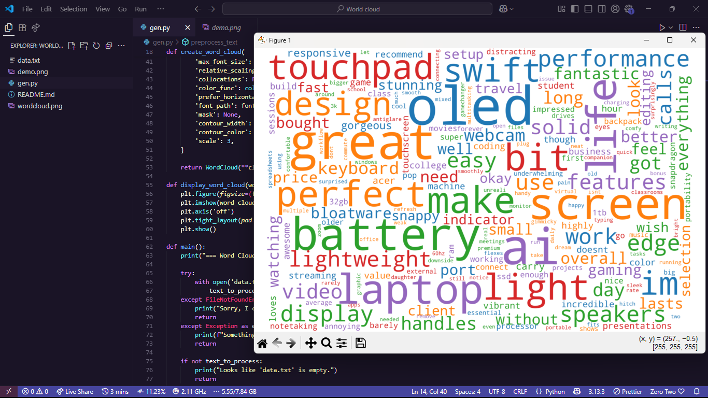

# Word Cloud Generator

A simple script that turns your text into a word cloud. It was put together by 0x3ef8 to help visualize the most common words in a fun and colorful way. You can use it to create word clouds from any text file, like reviews or notes.



## What You Need

To run this script, you'll need a few things:
- **Python 3.6 or higher**: Make sure Python is installed on your computer.
- A text file named `data.txt` in the same folder as the script, containing the text you want to turn into a word cloud (e.g., product reviews or any text).
- Some Python libraries (listed in `requirements.txt`).

## How to Set It Up

1. **Install Python**: If you don't have Python, download and install it from [python.org](https://www.python.org/downloads/). Make sure to add Python to your PATH during installation.
2. **Get the script**: Save the `gen.py` script in a folder on your computer.
3. **Prepare your text**: Create a file named `data.txt` in the same folder as the script. Put the text you want to use for the word cloud in this file. For example, you could copy and paste reviews or any text you like.
4. **Install dependencies**: Open a terminal (Command Prompt on Windows, Terminal on macOS/Linux) and navigate to the folder with the script using `cd path/to/your/folder`. Then run:
   ```
   pip install -r requirements.txt
   ```
   This installs the libraries needed (NumPy, WordCloud, Matplotlib, and Pillow).

## How to Run It

1. Make sure `data.txt` is in the same folder as `gen.py`.
2. In your terminal, navigate to the folder with the script (if you’re not already there) using `cd path/to/your/folder`.
3. Run the script by typing:
   ```
   python gen.py
   ```
4. The script will:
   - Read the text from `data.txt`.
   - Show a word cloud on your screen.
   - Ask if you want to save the word cloud as an image.
5. If you choose to save (by typing `y` or `yes`), enter a filename or press Enter to use the default (`wordcloud.png`). The image will be saved in the same folder.

## Example

If your `data.txt` contains something like:
```
I love the Acer Swift Edge 14 AI! It's lightweight and the battery lasts all day. The OLED screen is amazing for watching movies.
```
The script will create a word cloud highlighting words like "lightweight," "battery," and "OLED." You’ll see the word cloud pop up, and you can save it as a PNG file.

## Troubleshooting

- **Error: 'data.txt' not found**: Make sure `data.txt` is in the same folder as the script.
- **Error: Module not found**: Run `pip install -r requirements.txt` again to ensure all libraries are installed.
- **No word cloud shows up**: Check that your Python environment has a graphical backend for Matplotlib (this is usually automatic on most systems).

## Notes

- The word cloud uses a white background and random colors for words. It skips common words like "the" and "is" automatically.
- The script was tested on Windows, macOS, and Linux with Python 3.8+.
- If you have any issues, double-check that your text file isn’t empty and that all dependencies are installed.

Thanks for trying this out! Hope it helps you make some cool word clouds.
